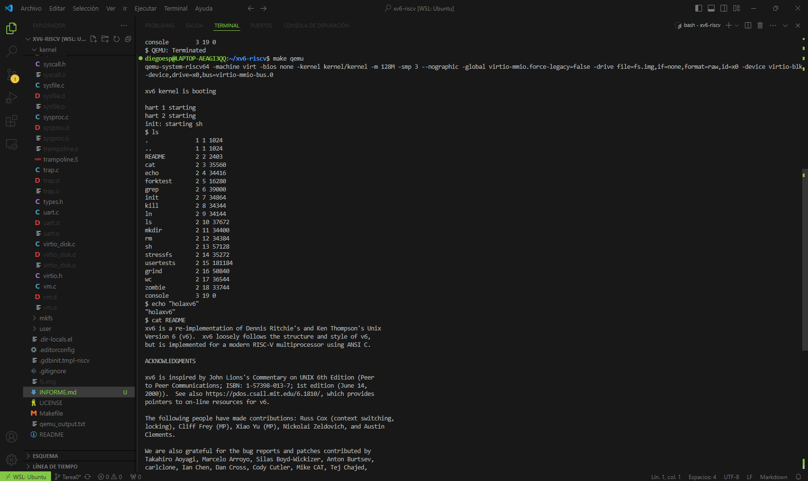

# Tarea 0
**Diego Espinoza**

## Pasos seguidos para instalar xv6

Lo primero fue abrir la terminal para instalar WSL (Subsistema de Windows para Linux), que permite la instalación de sistemas operativos de la familia GNU/Linux en Windows, como Ubuntu, que es lo solicitado para este ramo. Para construir y correr XV6 se realizaron los siguientes pasos:

```bash
$ sudo apt-get update -y
$ sudo apt-get install git make gcc wget qemu qemu-kvm gdb -y
$ git clone https://github.com/mit-pdos/xv6-public.git
```
Estos comandos actualizan la lista de paquetes en el sistema e instalan herramientas esenciales como git, make, gcc, wget, qemu, qemu-kvm, y gdb. Finalmente, se clona el repositorio xv6-public desde GitHub, que contiene el código fuente del sistema operativo educativo xv6 sin RICS-V para probar si la instalación funciona.

Luego, debido a que utilizaremos RICS-V y Toolchain, se procede a su instalación. Para ello, se instalan las dependencias necesarias:
```bash
$ sudo apt-get install autoconf automake autotools-dev curl python3 libmpc-dev libmpfr-dev libgmp-dev gawk build-essential bison flex texinfo gperf libtool patchutils bc zlib1g-dev libexpat-dev
```

Después de realizar eso, se crea un directorio risc-v en tu carpeta de inicio y se clona el repositorio de la herramienta RISC-V con:

```bash
$ git clone https://github.com/riscv/riscv-gnu-toolchain
```

Luego, se crea un directorio /opt/riscv y se configura y compila la herramienta con:

```bash
$ ./configure --prefix=/opt/riscv
$ make linux
```

Esto puede tardar varias horas. Finalmente, se debe agregar /opt/riscv/bin a la variable PATH editando el archivo ~/.bashrc para que las herramientas de RISC-V estén disponibles sin necesidad de especificar la ruta.

## Problemas encontrados y soluciones
Repositorio Antiguo: El primer problema fue buscar un repositorio que no fuera tan antiguo para poder clonarlo. Buscar repositorios antiguos puede significar problemas de actualizaciones.

Instalación de RISC-V y Toolchain: Se presentó un problema al buscar un método funcional para instalar RISC-V y Toolchain, ya que existían métodos explicados de forma muy general, estancándose en diversos pasos de la instalación.

Error en QEMU: Tras instalar las herramientas y verificar sus versiones, al compilar todo lo necesario para que funcione xv6, surgió el error de que no aparecía la ventana de QEMU y el proceso quedaba colgado. La solución fue utilizar una versión más moderna de QEMU. Se estaba utilizando la versión 6.2.0 y era necesario usar la 7.2.0. Dado que no se encontró una forma de actualizar, se utilizó una IA para apoyar la instalación, logrando instalar QEMU desde el código fuente usando el siguiente repositorio: https://gitlab.com/qemu-project/qemu.git.

## Confirmación de que xv6 está funcionando correctamente
Tras realizar todo lo mencionado anteriormente, se procede a utilizar el comando make qemu para hacer funcionar xv6, dando como resultado la siguiente vista:



## Refencias

[Instalación XV6](https://oslab.kaist.ac.kr/xv6-install/?ckattempt=1)

[Instalación RISC-V Toolchain](https://bernardnongpoh.github.io/posts/riscv)

[Rama repositorio base Diego Espinoza ](https://github.com/Diegoespm911/xv6-riscv.git)