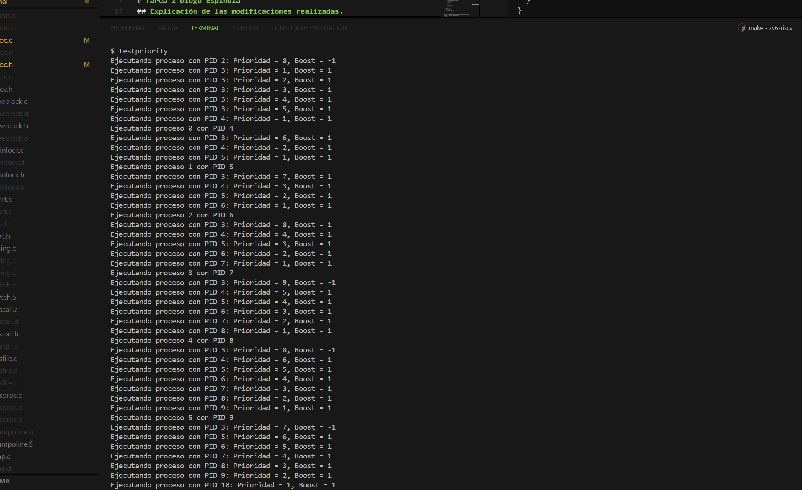
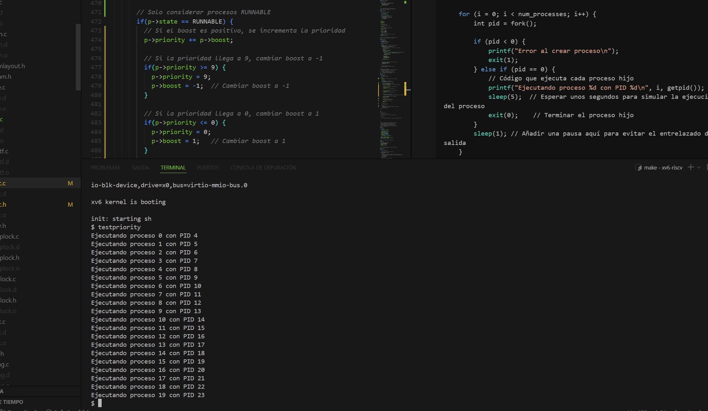

# Tarea 2 Diego Espinoza


## Funcionamiento y lógica del sistema de prioridades.
El código en `testpriority.c` se encarga de crear y ejecutar múltiples procesos en un entorno de sistema operativo simulado.


```bash
int main(void) {
    int num_processes = 20; // Crear 20 procesos
    int i;

    for (i = 0; i < num_processes; i++) {
        int pid = fork();

        if (pid < 0) {
            printf("Error al crear proceso\n");
            exit(1);
        } else if (pid == 0) {
            // Código que ejecuta cada proceso hijo
            printf("Ejecutando proceso %d con PID %d\n", i, getpid());
            sleep(5);  // Esperar unos segundos para simular la ejecución del proceso
            exit(0);    // Terminar el proceso hijo
        }
        sleep(1); // Añadir una pausa aquí para evitar el entrelazado de salida
    }

    // Esperar a que todos los procesos hijos terminen
    for (i = 0; i < num_processes; i++) {
        wait(0);
    }

    exit(0);
}
```
Se define la variable `num_processes` para indicar cuántos procesos se van a crear (20 en este caso) y se declara la variable i que se utilizará para los bucles.

Despues se procede a iniciar un bucle que itera 20 veces. En cada iteración, se llama a la función `fork()`, que crea un nuevo proceso hijo. La variable pid almacena el ID de proceso del nuevo proceso.

* Si pid es menor que 0, se imprime un mensaje de error y se termina el programa. Esto indica que no se pudo crear el proceso. 
* Si pid es igual a 0, significa que estamos en el contexto del proceso hijo.

Cada proceso hijo imprime su número de proceso (su índice i en el bucle) y su ID de proceso (PID) usando `getpid()`.
Luego, el proceso hijo se pone en espera durante 40 segundos con `sleep(5)`, simulando una ejecución prolongada.
Finalmente, el proceso hijo llama a exit(0) para finalizar su ejecución.

```bash
sleep(1); // Añadir una pausa aquí para evitar el entrelazado de salida
```

Esta línea se añade después de crear cada proceso para permitir que los procesos hijos tengan tiempo de iniciarse y evitar que sus mensajes de salida se entrelacen en la terminal.

Después de crear todos los procesos, el proceso padre entra en otro bucle donde espera a que cada uno de los procesos hijos termine su ejecución. La función `wait(0)` se utiliza para esperar a que un proceso hijo termine.

Ahora, la función `scheduler` ubicada en `proc.c` implementa un planificador que gestiona la ejecución de procesos en un sistema operativo simulado. Busca continuamente procesos en estado `RUNNABLE`, ajusta sus prioridades utilizando un sistema de boost, y cambia su estado a `RUNNING` cuando se seleccionan para la ejecución. Si no hay procesos disponibles, la CPU espera por interrupciones. Esto permite una planificación dinámica y eficiente en función de las prioridades de los procesos que va de la mano con lo solicitado en la tarea en relación a que las modificaciones no afecten el rendimiento del sistema.

## Explicación de las modificaciones realizadas.

Antes que todo se limita el sistema a una sola CPU modificando el `Makefile`:

```bash
ifndef CPUS
CPUS := 1
endif
```

Siguiendo con los códigos agregados, se implementan en `proc.h` específicamente en `struct proc` los siguientes campos:

```bash
int priority;                // Campo para la prioridad del proceso
  int boost;                 // Campo para el boost del proceso
```
Luego se implementa en `proc.c` las inicializaciones en la función `allocproc()`;

```bash
  // Inicializar prioridad y boost
  p->priority = 0;  // Inicializa la prioridad en 0
  p->boost = 1;     // Inicializa el boost en 1
```


Y por último se cambia el funcionamiento (explicado en el inciso anterior)del `scheduler` para que funcione acorde a lo solicitado:


```bash
void
scheduler(void)
{
  struct proc *p;
  struct cpu *c = mycpu();


  c->proc = 0;
  for(;;) {
    // Habilitar interrupciones para evitar deadlocks
    intr_on();


    int found = 0;
    for(p = proc; p < &proc[NPROC]; p++) {
      acquire(&p->lock);
     
      // Solo considerar procesos RUNNABLE
      if(p->state == RUNNABLE) {
        // Si el boost es positivo, se incrementa la prioridad
        p->priority += p->boost;


        // Si la prioridad llega a 9, cambiar boost a -1
        if(p->priority >= 9) {
          p->priority = 9;
          p->boost = -1;  // Cambiar boost a -1
        }


        // Si la prioridad llega a 0, cambiar boost a 1
        if(p->priority <= 0) {
          p->priority = 0;
          p->boost = 1;   // Cambiar boost a 1
        }


        // Imprimir prioridad y boost
        //printf("Ejecutando proceso con PID %d: Prioridad = %d, Boost = %d\n", p->pid, p->priority, p->boost);


        // Cambiar el estado del proceso a RUNNING
        p->state = RUNNING;
        c->proc = p;


        // Ejecutar el proceso
        swtch(&c->context, &p->context);


        // Proceso deja de ejecutarse
        c->proc = 0;
        found = 1;
      }


      release(&p->lock);
    }


    if(found == 0) {
      // No hay procesos RUNNABLE; espera una interrupción
      intr_on();
      asm volatile("wfi");
    }
  }
}
```

Para asegurarnos de que la funcionalidad está implementada de forma correcta, se coloca el siguiente printf:
```bash
// Imprimir prioridad y boost
printf("Ejecutando proceso con PID %d: Prioridad = %d, Boost = %d\n", p->pid, p->priority, p->boost);
```

Arrojando lo siguiente por pantalla:



Acá podemos ver que las iteraciones van acorde a lo solicitado, y que cuando llegan a 9 pasa el boost a -1 y cuando llegan a 0 pasan a 1, además, de que cuanado llega cada prioridad llega con prioridad 1.

Cómo se solicita en la tarea, al comentar el proceso anterior se nos muestra los 20 procesos con sus PIDs correctos de forma ordenada. Además de indicar el proceso implementado se llama `testpriority.c` ubicado en la carpeta user.



Finalmente se agrega dicha funcionalidad en el Makefile:
```bash
$U/_testpriority
```

## Dificultades encontradas y soluciones implementadas.

- Una de las dificultades encontradas fue en entender de cierta forma el contexto de la tarea, me hacía preguntas de cómo poder desarrollar la lógica de lo solicitado y de cómo crear el programa de pruebas. 

- Por otro lado, tuve problemas con las modificaciones del scheduler, muchos errores iniciales al momento de correr el XV6. Problemas de sintaxis difícil de darse cuenta pero que al momento de resolverlos todo empezó a funcionar de forma correcta.

- Por último, más que una dificultad, era la manera de comprobar que la lógica del código esté funcionando bien, por lo que tuve que implementar muchos printf para verificar que todo esté funcionando cómo lo solicitan en la tarea.
