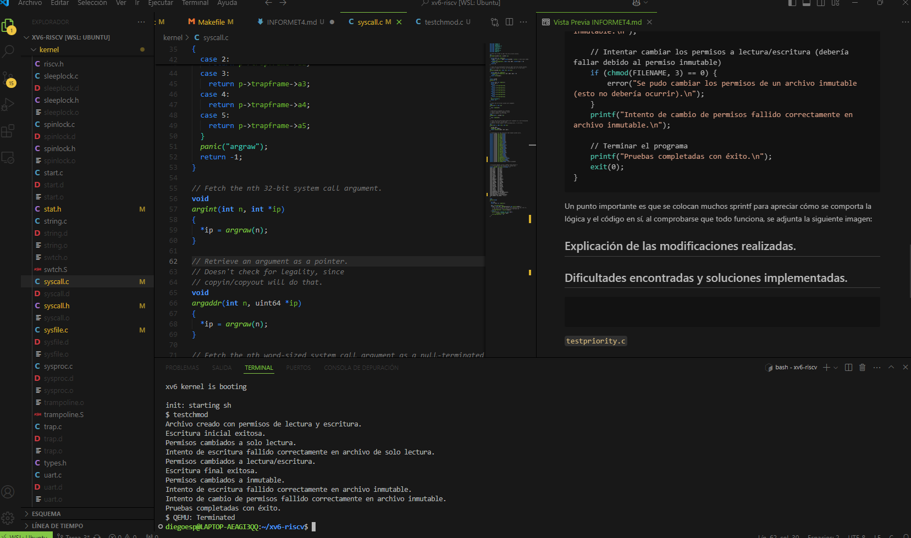

# Tarea 4 Diego Espinoza

La tarea 4 consiste en implementar un sistema de permisos básicos en xv6 (RISC-V), que permita definir permisos de lectura y escritura en los archivos a través de la estructura del inode. Se deben modificar las funciones de apertura, lectura y escritura para respetar estos permisos y crear la llamada al sistema chmod para cambiarlos. Además, se debe agregar un permiso especial para marcar los archivos como inmutables, impidiendo la modificación de sus permisos. Las pruebas incluyen verificar la creación, modificación y restricción de permisos de archivos. Para poder abordar esta tarea se procede a explicar el funcionamiento y lógica junto con la explicación de las modificaciones y las dificultades encontradas.


## Funcionamiento y lógica.

Para entender la logica, se parte por explicar como funciona el archvio de testeo para todas las modificaciones que se explican en el punto siguiente, el archivo `testchmod.c` está diseñado para verificar el correcto funcionamiento de las funciones `chmod()` y `open()` en xv6, enfocándose en la gestión de permisos de archivos. 

Inicialmente, el programa crea un archivo llamado `testfile` con permisos de lectura y escritura `(O_CREATE | O_RDWR)`. Luego, escribe datos en el archivo para confirmar que se creó correctamente y que es accesible para escritura. A continuación, se cambia el permiso a solo lectura usando `chmod(FILENAME, 1)`, y se verifica que el sistema impida escribir en el archivo. Este paso asegura que el sistema respeta los permisos de solo lectura.

Posteriormente, el programa restaura los permisos de lectura y escritura `(chmod(FILENAME, 3))` y verifica que se pueda escribir nuevamente en el archivo. Luego, se establece el archivo como inmutable mediante `chmod(FILENAME, 5)`. En este estado, el archivo no debería permitir ni escritura ni cambios de permisos. El programa confirma que la inmutabilidad es efectiva intentando escribir en el archivo y cambiando sus permisos, acciones que deben fallar para asegurar que el sistema está aplicando correctamente la protección de inmutabilidad.

Al finalizar, se valida que cada intento de acceso o modificación prohibido genera el comportamiento esperado. Si todas las pruebas son exitosas.

Acá el codigo:

```bash
#include "types.h"
#include "stat.h"
#include "fcntl.h"  // Incluye las macros O_CREATE y O_RDWR
#include "user.h"

#define FILENAME "testfile"

// Función para imprimir mensaje de error
void error(char *msg) {
    printf(msg);
    exit(1);
}

int main(void) {
    int fd;

    // Crear un archivo con permisos de lectura y escritura (O_CREATE | O_RDWR)
    fd = open(FILENAME, O_CREATE | O_RDWR);
    if (fd < 0) {
        error("No se pudo crear el archivo con permisos de lectura y escritura.\n");
    }
    printf("Archivo creado con permisos de lectura y escritura.\n");

    // Escribir datos en el archivo para asegurar que la creación y escritura funcionan
    write(fd, "Este es un archivo de prueba.\n", 28);
    close(fd);
    printf("Escritura inicial exitosa.\n");

    // Cambiar los permisos a solo lectura (chmod(filename, 1))
    if (chmod(FILENAME, 1) < 0) {
        error("Error al cambiar permisos a solo lectura.\n");
    }
    printf("Permisos cambiados a solo lectura.\n");

    // Intentar escribir en el archivo (debería fallar)
    fd = open(FILENAME, O_WRONLY);
    if (fd >= 0) {
        error("Se pudo escribir en un archivo de solo lectura (esto no debería ocurrir).\n");
    }
    printf("Intento de escritura fallido correctamente en archivo de solo lectura.\n");

    // Cambiar los permisos a lectura/escritura (chmod(filename, 3))
    if (chmod(FILENAME, 3) < 0) {
        error("Error al cambiar permisos a lectura/escritura.\n");
    }
    printf("Permisos cambiados a lectura/escritura.\n");

    // Intentar escribir nuevamente (debería funcionar)
    fd = open(FILENAME, O_WRONLY);
    if (fd < 0) {
        error("No se pudo abrir el archivo para escritura.\n");
    }
    write(fd, "Escritura después de cambio de permisos.\n", 37);
    close(fd);
    printf("Escritura final exitosa.\n");

    // Cambiar los permisos a inmutable (chmod(filename, 5))
    if (chmod(FILENAME, 5) < 0) {
        error("Error al cambiar permisos a inmutable.\n");
    }
    printf("Permisos cambiados a inmutable.\n");

    // Intentar escribir en el archivo (debería fallar debido al permiso inmutable)
    fd = open(FILENAME, O_WRONLY);
    if (fd >= 0) {
        error("Se pudo escribir en un archivo inmutable (esto no debería ocurrir).\n");
    }
    printf("Intento de escritura fallido correctamente en archivo inmutable.\n");

    // Intentar cambiar los permisos a lectura/escritura (debería fallar debido al permiso inmutable)
    if (chmod(FILENAME, 3) == 0) {
        error("Se pudo cambiar los permisos de un archivo inmutable (esto no debería ocurrir).\n");
    }
    printf("Intento de cambio de permisos fallido correctamente en archivo inmutable.\n");

    // Terminar el programa
    printf("Pruebas completadas con éxito.\n");
    exit(0);
}
```
Un punto importante es que se colocan muchos sprintf para apreciar cómo se comporta la lógica y el código en sí, al comprobarse que todo funciona, se adjunta la siguiente imagen:



El cual muestra evidencia de que las funciones junto al archivo de testeo funcionan mostrando todo lo solicitado por la tarea 4.


## Explicación de las modificaciones realizadas.

Para ver lo que funciona por detrás del archivo de testeo, se muestran todos los cambios que se hicieron:

### `fs.h`
En el archivo `fs.h` se procede a agregar el campo de los permisos en la estructura dinode:

```bash
// On-disk inode structure
struct dinode {
  short type;           // File type
  short major;          // Major device number (T_DEVICE only)
  short minor;          // Minor device number (T_DEVICE only)
  short nlink;          // Number of links to inode in file system
  uint size;            // Size of file (bytes)
  uint addrs[NDIRECT+1];   // Data block addresses
  int permissions;      // Permisos: 0 (ninguno), 1 (lectura), 2 (escritura), 3 (lectura/escritura)
};
```

### `file.h`


Luego, se tiene que hacer lo mismo pero para la estructura inode en el archivo file.h:


```bash
// in-memory copy of an inode
struct inode {
  uint dev;           // Device number
  uint inum;          // Inode number
  int ref;            // Reference count
  struct sleeplock lock; // protects everything below here
  int valid;          // inode has been read from disk?
  short type;         // copy of disk inode
  short major;
  short minor;
  short nlink;
  uint size;
  uint addrs[NDIRECT+1];
 
  int permissions;     // Permisos: 0 (ninguno), 1 (lectura), 2 (escritura), 3 (lectura/escritura)
};
```

### `sysfile.c`

Continuando con las modificaciones, tenemos las funciones principales implementadas en el archivo `sysfile.c`, sys_open, que se modifica para cumplir con los requerimientos:

## `sys_open`

```bash
uint64 sys_open(void) {
  char path[MAXPATH];
  int fd, omode;
  struct file *f;
  struct inode *ip;
  int n;


  // Obtener parámetros: modo de apertura y ruta del archivo
  argint(1, &omode);
  if ((n = argstr(0, path, MAXPATH)) < 0)
    return -1;


  begin_op();


  // Si se pide crear el archivo
  if (omode & O_CREATE) {
    ip = create(path, T_FILE, 0, 0);
    if (ip == 0) {
      end_op();
      return -1;
    }
  } else {
    // Buscar el archivo por su ruta
    if ((ip = namei(path)) == 0) {
      end_op();
      return -1;
    }
    ilock(ip);


    // Si el archivo es un directorio y no se pide solo lectura, error
    if (ip->type == T_DIR && omode != O_RDONLY) {
      iunlockput(ip);
      end_op();
      return -1;
    }


    // Verificar permisos de apertura (lectura/escritura)
    if (ip->permissions == 5) {  // Si el archivo es inmutable
      if (omode != O_RDONLY) {  // No se puede escribir
        iunlockput(ip);
        end_op();
        return -1;
      }
    } else {
      // Verificar permisos de lectura/escritura
      if ((omode & O_WRONLY) && !(ip->permissions & 2)) {  // Verificar permiso de escritura
        iunlockput(ip);
        end_op();
        return -1;
      }


      if ((omode & O_RDONLY) && !(ip->permissions & 1)) {  // Verificar permiso de lectura
        iunlockput(ip);
        end_op();
        return -1;
      }
    }
  }


  // Verificación de dispositivos
  if (ip->type == T_DEVICE && (ip->major < 0 || ip->major >= NDEV)) {
    iunlockput(ip);
    end_op();
    return -1;
  }


  // Asignar descriptor de archivo
  if ((f = filealloc()) == 0 || (fd = fdalloc(f)) < 0) {
    if (f)
      fileclose(f);
    iunlockput(ip);
    end_op();
    return -1;
  }


  // Configurar el archivo en el descriptor
  if (ip->type == T_DEVICE) {
    f->type = FD_DEVICE;
    f->major = ip->major;
  } else {
    f->type = FD_INODE;
    f->off = 0;
  }
  f->ip = ip;
  f->readable = !(omode & O_WRONLY);
  f->writable = (omode & O_WRONLY) || (omode & O_RDWR);


  // Si se solicita truncar el archivo, hacerlo
  if ((omode & O_TRUNC) && ip->type == T_FILE) {
    itrunc(ip);
  }


  iunlock(ip);
  end_op();


  return fd;
}
```
La función `sys_open` es responsable de abrir archivos en el sistema operativo basado en xv6. Permite que los procesos interactúen con el sistema de archivos para realizar operaciones de lectura, escritura o ambas, dependiendo del modo especificado. Los parámetros que recibe son la ruta del archivo y el modo de apertura. Primero, la función valida estos parámetros para asegurar que la ruta sea válida y que el modo de apertura cumpla con los valores permitidos.

Si el modo incluye la creación del archivo `(O_CREATE)`, la función intenta crearlo usando `create`. En caso contrario, busca el archivo con `namei`. Si el archivo no se encuentra o si es un directorio y se intenta abrir en un modo distinto a solo lectura, la operación falla. Además, la función verifica los permisos del archivo. Si el archivo es inmutable, sólo se permite abrirlo en modo de lectura. En otros casos, se validan los permisos de lectura y escritura según el modo solicitado. Si el archivo es un dispositivo, se verifica que su número mayor sea válido.

Una vez superadas las verificaciones, se asigna un descriptor de archivo utilizando `filealloc` y `fdalloc`. Este descriptor es necesario para que el proceso interactúe con el archivo en operaciones futuras. Si el modo incluye`O_TRUNC`, la función trunca el archivo a una longitud de 0 bytes. Finalmente, la función devuelve el descriptor asignado o `-1` en caso de error, indicando el éxito o fracaso de la operación. Luego viene la funcion que se tiene que crear: 

## `sys_chmod`

```bash
uint64 sys_chmod(void) {
  char path[MAXPATH];
  int mode;
  struct inode *ip;


  // Obtener parámetros: ruta del archivo y el modo de permiso
  argint(1, &mode);
  if (argstr(0, path, MAXPATH) < 0 || mode < 0)
    return -1;


  begin_op();


  // Buscar el archivo por su ruta
  if ((ip = namei(path)) == 0) {
    end_op();
    printf("Archivo no encontrado.\n");
    return -1;
  }


  ilock(ip);


  // Si el archivo es inmutable, no se puede cambiar su permiso
  if (ip->permissions == 5) {
    iunlockput(ip);
    end_op();
    return -1;
  }


  // Cambiar los permisos del archivo
  ip->permissions = mode;
  iupdate(ip);
  iunlockput(ip);
  end_op();


  return 0;
}
```
La función `sys_chmod` permite modificar los permisos de un archivo, brindando control sobre quién puede acceder al archivo y cómo. Recibe como parámetros la ruta del archivo y el nuevo modo de permisos. Primero, valida que la ruta y el modo sean correctos para evitar errores en la operación.

Luego, busca el archivo especificado utilizando `namei`. Si el archivo no se encuentra, la función devuelve un error y termina la operación. Si el archivo es inmutable, no se permite cambiar sus permisos, y la función devuelve un error. En caso contrario, se procede a modificar los permisos del archivo con el valor recibido.
Una vez actualizados los permisos, se guarda la nueva configuración del archivo mediante `iupdate`, se desbloquea el inodo con `iunlockput`, y se termina la operación con `end_op`. Si todo se realiza correctamente, la función devuelve 0, indicando éxito; de lo contrario, retorna `-1`, señalando un error en el proceso.

### `stat.h`

Para finalizar, vienen las modificaciones necesarias para las llamadas y el archivo de testeo que se crea en la carpeta user funcione:
stat.h:

```bash
#define T_DIR     1   // Directory
#define T_FILE    2   // File
#define T_DEVICE  3   // Device


struct stat {
  int dev;     // File system's disk device
  uint ino;    // Inode number
  short type;  // Type of file
  short nlink; // Number of links to file
  uint64 size; // Size of file in bytes
  short permissions;  // Permisos del archivo (nuevo campo)
};
```
### `syscall.c:`

```bash
extern uint64 sys_chmod(void); //Nuevo agregado
[SYS_chmod] sys_chmod, //Nuevo
```

### `syscall.h:`

```bash
#define SYS_chmod 26 //Nuevo
```

### `user.h:`

```bash
int chmod(const char *path, int mode); //Nuevo agregado

```

### `usys.pl:`

```bash
entry("chmod"); #generar llamada
```

### `Makefile:`

```bash
    $U/_testchmod
```


## Dificultades encontradas y soluciones implementadas.

Las dificultades presentadas son las siguientes:
- Partiendo por la definición de las funciones en sysfile.c, tuve errores con el funcionamiento de la lógica de argint lo que provocaba que ni siquiera corriera el xv6, después de leer documentación y consultar con el profe, se pudo solucionar.

- Otro error era el manejo de dinode e inode, el cual debía aplicar los campos de los permisos a ambos pero en un principio solo lo hice en el struc inode, después de analizar bien el código y analizar los archivos pude encontrar el struct inode y poder solucionar el problema.

- Siguiendo con los problemas, la forma en que desarrollé el archivo de texto en un principio no servía ya que utilizaba otro formato para tratar las variables por lo que al tratar de correrlo no hacía funcionar su lógica, pero luego de cambiar dicha lógica todo funcionó sin problemas.

Destacar que esta tarea ha sido una de las difíciles debido a la complejidad de cumplir con los requerimientos de la tarea, sumando a entender en sí la tarea, lo que lo hizo un desafío complejo pero entretenido en sí.
